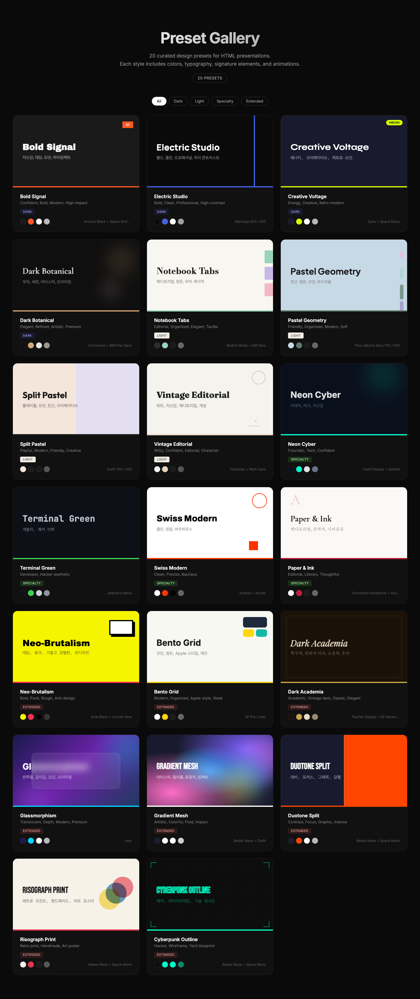
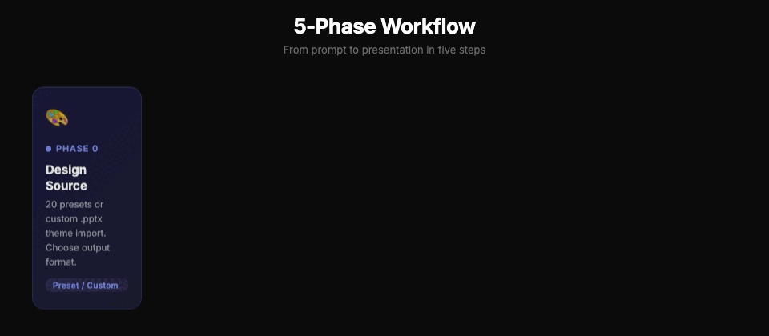

# oh-my-slides

자연어 프롬프트로 애니메이션이 풍부한 HTML 프레젠테이션을 생성하는 [Claude Code](https://docs.anthropic.com/en/docs/claude-code) 플러그인. 20가지 큐레이션된 디자인 프리셋, PPTX 내보내기, 외부 의존성 없는 단일 HTML 출력.

[English](README.md) | **한국어**



> **[라이브 데모](https://seongyeon1.github.io/oh-my-slides/)** | [`gallery.html`](gallery.html)을 로컬에서 열어도 동일한 경험을 할 수 있습니다.

---

## 빠른 시작

### 1. 설치

```bash
git clone https://github.com/seongyeon1/oh-my-slides.git
cd oh-my-slides
bash install.sh
```

설치 스크립트가 자동으로:
- npm 의존성 설치 (Playwright, PptxGenJS, Sharp)
- Claude Code 플러그인 시스템에 등록
- 플러그인 활성화

### 2. Claude Code 재시작

Claude Code를 닫고 다시 열거나 새 세션을 시작하세요.

### 3. 사용

```
> PPT 만들어줘: AI 기술 트렌드 2026
> 발표자료 만들어줘 — 주제: LLM Fine-tuning 실전 가이드
> Create a presentation about microservices architecture
```

한국어와 영어 모두 프레젠테이션 관련 키워드로 자동 트리거됩니다.

### 제거

```bash
bash uninstall.sh
```

Claude Code에서 플러그인 등록만 제거합니다. 소스 파일은 그대로 유지됩니다.

---

## 작동 방식

### 5단계 워크플로우



**Phase 0** — 두 가지를 질문합니다: 디자인 소스 (프리셋 or 커스텀 .pptx 임포트)와 출력 형식 (Viewport HTML or Slide Template).

**Phase 2** — oh-my-slides가 기존 도구와 다른 점입니다. "어떤 색상을 원하세요?"라고 묻는 대신, 3개의 미니 프리뷰 HTML을 생성하고 Playwright로 스크린샷을 찍어 나란히 보여줍니다. 시각적으로 선택하세요.

**Phase 4** — 하나의 self-contained HTML 파일을 생성합니다. 모든 슬라이드가 정확히 `100vh` 높이이며 내부 스크롤이 없습니다. `clamp()`를 통한 타이포그래피 스케일링으로 13인치 노트북부터 4K 모니터까지 올바르게 렌더링됩니다.

---

## 핵심 개념

### Viewport Fitting (뷰포트 맞춤)

모든 슬라이드에 `height: 100dvh; overflow: hidden`을 적용합니다. 폰트와 간격은 `clamp()`와 높이 기반 미디어 쿼리를 사용하여 작은 화면에서 단계적으로 축소됩니다:

```css
--title-size: clamp(2rem, 6vw, 5rem);
--slide-padding: clamp(1rem, 4vw, 4rem);

@media (max-height: 700px) { /* 패딩 축소 */ }
@media (max-height: 500px) { /* 제목 축소 */ }
```

### Signature Elements (시그니처 요소)

각 프리셋에는 고유한 시각적 시그니처가 있습니다 (예: Creative Voltage의 하프톤 텍스처, Dark Academia의 이중 인셋 테두리). 이 시그니처는 프레젠테이션의 모든 슬라이드에 일관되게 반복되며, 다른 프리셋의 시그니처를 혼합하는 것은 금지됩니다.

### Zero-dependency HTML (무의존성 HTML)

출력은 인라인 CSS와 JS가 포함된 단일 `.html` 파일입니다. 폰트는 Google Fonts에서 `<link>`로 로드합니다. 빌드 과정, 프레임워크, 런타임 의존성 없이 아무 브라우저에서 열어 바로 발표할 수 있습니다.

### Dual Output (이중 출력)

- **HTML** — 발표용 (애니메이션, 키보드/터치 네비게이션, 프로그레스 바)
- **PPTX** — 편집용 (PowerPoint, Keynote, Google Slides)

---

## 20가지 디자인 프리셋

| # | 프리셋 | 느낌 | 폰트 페어링 |
|---|--------|------|-------------|
| 1 | **Bold Signal** | 자신감, 대담, 하이임팩트 | Archivo Black + Space Grotesk |
| 2 | **Electric Studio** | 클린, 프로페셔널, 하이 콘트라스트 | Manrope 800 / 400 |
| 3 | **Creative Voltage** | 에너지, 크리에이티브, 레트로-모던 | Syne + Space Mono |
| 4 | **Dark Botanical** | 우아, 세련, 프리미엄 | Cormorant + IBM Plex Sans |
| 5 | **Notebook Tabs** | 에디토리얼, 정돈, 촉각적 | Bodoni Moda + DM Sans |
| 6 | **Pastel Geometry** | 친근, 부드러움, 모던 | Plus Jakarta Sans |
| 7 | **Split Pastel** | 플레이풀, 크리에이티브, 친근 | Outfit |
| 8 | **Vintage Editorial** | 위트, 에디토리얼, 개성 | Fraunces + Work Sans |
| 9 | **Neon Cyber** | 미래적, 테크, 자신감 | Clash Display + Satoshi |
| 10 | **Terminal Green** | 개발자, 해커 미학 | JetBrains Mono |
| 11 | **Swiss Modern** | 클린, 정밀, 바우하우스 | Archivo + Nunito |
| 12 | **Paper & Ink** | 문학적, 에디토리얼, 사려깊음 | Cormorant Garamond + Source Serif 4 |
| 13 | **Neo-Brutalism** | 펑크, 반디자인, 대담 | Arial Black + Courier New |
| 14 | **Bento Grid** | Apple 스타일, 매끈, 정돈 | SF Pro / Inter |
| 15 | **Dark Academia** | 학구적, 빈티지, 고전적 | Playfair Display + EB Garamond |
| 16 | **Glassmorphism** | 반투명, 깊이감, 프리미엄 | Inter |
| 17 | **Gradient Mesh** | 아티스틱, 컬러풀, 유동적 | Bebas Neue + Outfit |
| 18 | **Duotone Split** | 대비, 그래픽, 강렬 | Bebas Neue + Space Mono |
| 19 | **Risograph Print** | 레트로, 핸드메이드, 아트 포스터 | Bebas Neue + Space Mono |
| 20 | **Cyberpunk Outline** | 와이어프레임, 해커, 청사진 | Bebas Neue + Space Mono |

### 발표 목적별 추천 매트릭스

| 발표 목적 | 1순위 | 2순위 | 3순위 |
|----------|-------|-------|-------|
| 기술 컨퍼런스 | Swiss Modern | Terminal Green | Cyberpunk Outline |
| 스타트업 피치 | Bold Signal | Gradient Mesh | Electric Studio |
| 학술/논문 발표 | Dark Academia | Paper & Ink | Swiss Modern |
| 팀 세미나 | Bento Grid | Notebook Tabs | Swiss Modern |
| 디자인/크리에이티브 | Risograph Print | Gradient Mesh | Neo-Brutalism |
| 데이터/분석 리포트 | Electric Studio | Swiss Modern | Bento Grid |
| 교육/튜토리얼 | Pastel Geometry | Notebook Tabs | Split Pastel |
| 제품 런칭 | Glassmorphism | Bold Signal | Neon Cyber |
| 코드 리뷰/기술 공유 | Terminal Green | Cyberpunk Outline | Dark Botanical |
| 투자자/경영진 보고 | Dark Botanical | Electric Studio | Paper & Ink |

프리셋은 `skills/oh-my-slides/templates/presets/`에 개별 CSS 파일로 저장되어 있습니다. 직접 추가할 수도 있습니다.

---

## 커스텀 테마 임포트

보유한 `.pptx` 파일에서 디자인 시스템을 추출하여 새 프리셋을 만들 수 있습니다:

```bash
node skills/oh-my-slides/scripts/import-pptx-theme.js company-template.pptx my-brand --dark
```

PPTX 테마 XML을 읽어 색상/폰트/미디어를 추출하고, Office 폰트를 Google Fonts로 자동 매핑하여 다음 파일을 생성합니다:
- `skills/oh-my-slides/templates/presets/custom-my-brand.css`
- `skills/oh-my-slides/templates/assets/custom-my-brand/`

---

## PPTX 내보내기

용도에 따라 세 가지 방식을 선택할 수 있습니다:

| 방식 | 스크립트 | 편집 가능? | 디자인 충실도 |
|------|---------|-----------|-------------|
| **Viewport 캡처** | `capture-viewport.js` | 아니오 | 픽셀 퍼펙트 |
| **Slide 캡처** | `capture-and-build.js` | 아니오 | 픽셀 퍼펙트 |
| **편집 가능 PPTX** | `build-editable-pptx.js` | **예** | 웹 안전 폰트 한정 |

```bash
# 이미지 기반 (픽셀 퍼펙트, 편집 불가) — 단일 Viewport HTML → PPTX
node skills/oh-my-slides/scripts/capture-viewport.js presentation.html output.pptx
node skills/oh-my-slides/scripts/capture-viewport.js presentation.html output.pptx --width=1200 --height=675

# 편집 가능 PPTX — PPTX-ready HTML 디렉토리 → 편집 가능한 .pptx
# slide*.html 파일을 순회하며 html2pptx로 변환해 실제 텍스트/도형/표 객체로 만듬
node skills/oh-my-slides/scripts/build-editable-pptx.js docs/workspace
node skills/oh-my-slides/scripts/build-editable-pptx.js docs/workspace docs/output.pptx
node skills/oh-my-slides/scripts/build-editable-pptx.js docs/workspace --pattern="slide-*.html"
```

### 편집 가능 PPTX 입력 요구사항

편집 모드는 텍스트/도형/표를 네이티브 PowerPoint 객체로 보존하므로, 입력 HTML이 PPTX 제약을
따라야 합니다 (브라우저 발표용 풍부한 Viewport HTML은 그대로 못 쓰고 **별도의 PPTX용
HTML**을 작성해야 합니다):

- **body 크기를 레이아웃에 맞춤**: 16:9 → `width: 960px; height: 540px` (= 720pt × 405pt)
- **웹 안전 폰트만**: Arial, Verdana, Georgia, Courier New
- **CSS 그라데이션 / 애니메이션 금지** (단색 사용; 그라데이션은 PNG로 미리 렌더링해 오버레이)
- **모든 텍스트는 시맨틱 태그 안에**: `<p>`, `<h1>`–`<h6>`, `<ul>`, `<ol>`
- 콘텐츠가 body를 넘치면 안 됨

[`skills/oh-my-slides/SKILL.md`](skills/oh-my-slides/SKILL.md) ("Phase 4-B 방식 A") 와
[`references/build-utilities.md`](skills/oh-my-slides/references/build-utilities.md) 에서
템플릿, 네이티브 테이블 헬퍼, 그라데이션 헤더 우회법을 확인하세요.

---

## 스크립트 레퍼런스

모든 스크립트는 `skills/oh-my-slides/scripts/`에 있습니다:

| 스크립트 | 설명 |
|---------|------|
| `capture-viewport.js` | 단일 Viewport HTML → 이미지 기반 PPTX. reveal 애니메이션 자동 활성화, UI 자동 숨김 |
| `capture-and-build.js` | 개별 슬라이드 템플릿 HTML (1280x720) → 이미지 기반 PPTX |
| `import-pptx-theme.js` | .pptx 테마 추출 → 커스텀 CSS 프리셋 + 미디어 에셋 |
| `render-preview.js` | 전체 슬라이드 → 프리뷰 그리드 이미지 (빠른 리뷰용) |
| `render-all.js` | 각 슬라이드 → 개별 PNG 파일 |
| `create-gradient.js` | Sharp로 그라데이션 PNG 생성 (PPTX 헤더 오버레이용) |
| `html2pptx.js` | 라이브러리: 단일 HTML 슬라이드 → pptxgenjs 편집 가능 슬라이드 (텍스트/도형/이미지) |
| `build-editable-pptx.js` | CLI: PPTX-ready HTML 디렉토리 → 편집 가능한 다중 슬라이드 `.pptx` (`html2pptx.js` 사용) |

---

## 프로젝트 구조

```
oh-my-slides/
├── .claude-plugin/
│   └── plugin.json              # Claude Code 플러그인 메타데이터
├── skills/
│   └── oh-my-slides/
│       ├── SKILL.md             # 스킬 정의 (5단계 워크플로우)
│       ├── references/
│       │   ├── design-guide.md  # 20가지 프리셋 사양 + 안티패턴
│       │   ├── slide-template.md # 1280x720 슬라이드 템플릿 가이드
│       │   └── build-utilities.md # PPTX 빌드 헬퍼
│       ├── templates/
│       │   ├── viewport-base.html # Viewport 모드 기본 HTML
│       │   ├── slide-base.html    # Slide Template 모드 기본 HTML
│       │   ├── presets/           # 20개 CSS 프리셋 파일
│       │   ├── layouts/           # 8개 슬라이드 레이아웃 패턴
│       │   └── components/        # 재사용 CSS 모듈
│       └── scripts/               # Node.js 자동화 스크립트 (8개)
├── gallery.html                   # 인터랙티브 프리셋 갤러리
├── install.sh                     # 원커맨드 설치
├── uninstall.sh                   # 깔끔한 제거
└── docs/
    └── preset-gallery.png         # README용 갤러리 스크린샷
```

---

## 요구사항

- [Claude Code](https://docs.anthropic.com/en/docs/claude-code) CLI, 데스크톱, 또는 IDE 확장
- Node.js 18+
- npm 의존성 (`install.sh`가 자동 설치):
  - [Playwright](https://playwright.dev/) — 스크린샷 캡처, PPTX 생성
  - [Sharp](https://sharp.pixelplumbing.com/) — 이미지 처리
  - [PptxGenJS](https://gitbrent.github.io/PptxGenJS/) — PPTX 파일 생성

---

## 수동 설치

설치 스크립트를 사용하지 않으려면:

1. 원하는 위치에 레포를 클론
2. 의존성 설치:
   ```bash
   npm install playwright pptxgenjs sharp
   npx playwright install chromium
   ```
3. 마켓플레이스 디렉토리 생성:
   ```bash
   mkdir -p ~/.claude/plugins/marketplaces/oh-my-slides-local/.claude-plugin
   mkdir -p ~/.claude/plugins/marketplaces/oh-my-slides-local/plugins
   ```
4. `~/.claude/plugins/marketplaces/oh-my-slides-local/.claude-plugin/marketplace.json` 작성:
   ```json
   {
     "name": "oh-my-slides-local",
     "description": "oh-my-slides 로컬 마켓플레이스",
     "plugins": [{
       "name": "oh-my-slides",
       "source": "./plugins/oh-my-slides",
       "category": "productivity"
     }]
   }
   ```
5. 플러그인 심링크:
   ```bash
   ln -s /path/to/oh-my-slides ~/.claude/plugins/marketplaces/oh-my-slides-local/plugins/oh-my-slides
   ```
6. `~/.claude/settings.json`에 추가:
   ```json
   {
     "enabledPlugins": {
       "oh-my-slides@oh-my-slides-local": true
     },
     "extraKnownMarketplaces": {
       "oh-my-slides-local": {
         "source": { "source": "directory", "path": "~/.claude/plugins/marketplaces/oh-my-slides-local" }
       }
     }
   }
   ```
7. Claude Code 재시작

---

## 라이선스

MIT
